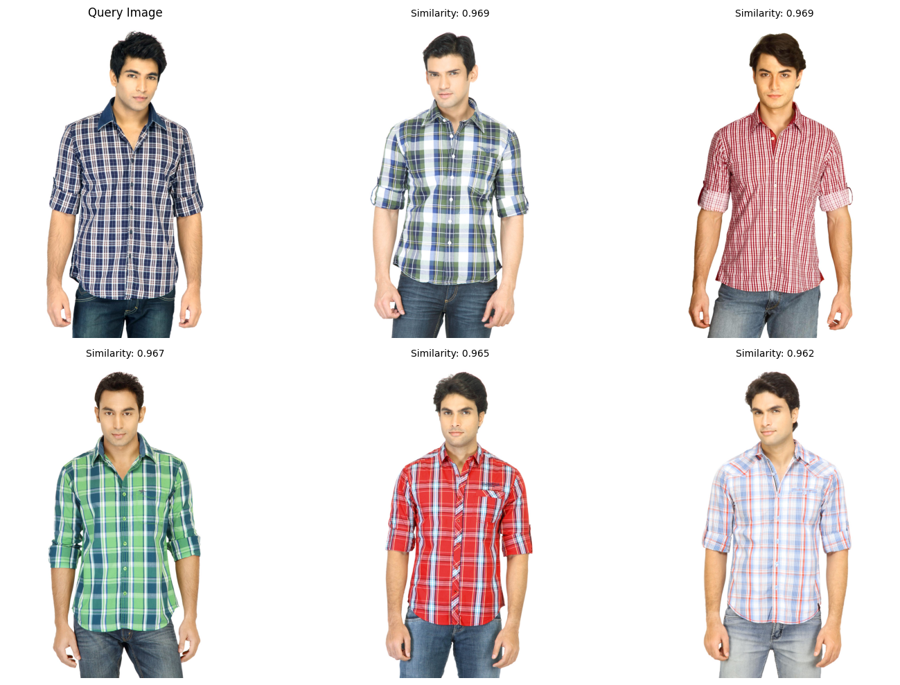

# README.md

## Project Overview
This project is an **Image Similarity Search System** built using PyTorch and various deep learning and machine learning libraries. The system extracts deep features from images using a pre-trained ResNet-50 model, indexes these features using MinHashLSH, and retrieves similar images based on a given query image. This approach is designed for scalable and efficient similarity search in an image dataset.

## Directory Structure
```
project_root/
  - main.py
  - model.py
  - image_search.py
  - utils.py
  - README.md
  - requirements.txt
  - fashion-dataset/
```
- **main.py**: Entry point for running the image indexing and search.
- **model.py**: Contains the `DeepImageEncoder` class for feature extraction.
- **image_search.py**: Implements the `ImageSimilaritySearch` class to index images and perform similarity search.
- **utils.py**: Utility functions, including the creation of MinHash objects.
- **README.md**: Project documentation.
- **requirements.txt**: List of Python dependencies.
- **fashion-dataset/**: Directory to store image data.

## Features
- **Deep Feature Extraction**: Uses a pre-trained ResNet-50 model with a custom layer for generating compact feature representations.
- **Efficient Image Indexing**: Indexes image features using MinHashLSH for scalable similarity search.
- **Customizable Hashing**: Adjustable dimensionality for hashing and number of permutations.
- **Visualization**: Displays the query image and its most similar results.

## Requirements
Ensure that the following dependencies are installed:
```
torch
pillow
torchvision
scikit-learn
datasketch
matplotlib
tqdm
```
Install dependencies using:
```
pip install -r requirements.txt
```

## Setup and Usage
### 1. Prepare the Dataset
Place your images inside the `fashion-dataset/` folder or specify another folder path.

### 2. Run the Image Indexing and Search
Execute the main script to index images and search for similar ones:
```
python main.py
```
Make sure to set the `DATASET_PATH` and `QUERY_IMAGE` variables in `main.py` to point to your dataset folder and query image path.

## Code Explanation
### 1. **model.py**
Defines the `DeepImageEncoder` class that extracts deep features from images using ResNet-50:
```python
class DeepImageEncoder(nn.Module):
    def __init__(self, hash_dim=128):
        # Initializes a modified ResNet-50 without the fully connected layer
```

### 2. **image_search.py**
Implements the `ImageSimilaritySearch` class, which:
- Extracts deep features from images.
- Creates MinHash objects for indexing.
- Finds similar images based on cosine similarity and MinHashLSH.

### 3. **utils.py**
Includes helper functions such as:
- `create_minhash()`: Converts feature vectors into MinHash objects for indexing.

## Example Output
The script visualizes the query image alongside the top similar images with their similarity scores:
  

## Customization
- **Hash Dimensionality**: Adjust `hash_dim` when initializing `DeepImageEncoder`.
- **Number of Results**: Modify the `num_results` parameter in `find_similar_images()` to change how many similar images are displayed.


---


