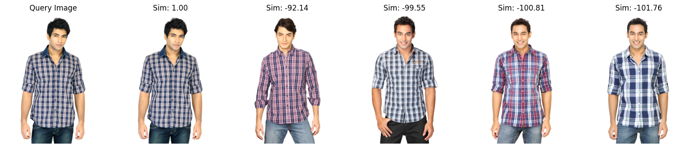

# Image Similarity Search

This project performs image similarity search using Vision Transformers (ViT) and FAISS. Given a query image, it retrieves the most visually similar images from a dataset.

## Features

- Embedding extraction with a pretrained ViT model.
- Similarity search with FAISS for efficient indexing and querying.
- Utility for displaying results.

## Configuration

All configuration settings, including paths, are located in `src/config.py`. Adjust paths if needed.

## Setup

1. **Install dependencies:**

    ```bash
    pip install -r requirements.txt
    ```

2. **Prepare the FAISS Index:**

    ```bash
    python src/main.py
    ```

## Usage

To search for the top 5 similar images to a query image, simply run:

```bash
python src/main.py
```


## Output
The script visualizes the query image alongside the top similar images with their similarity scores:

  

