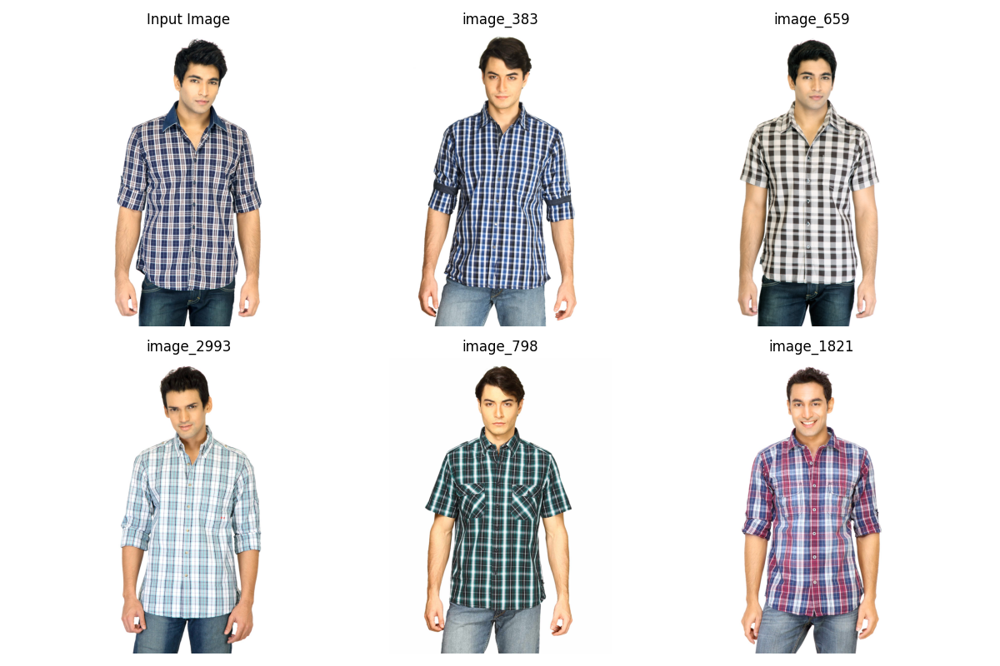
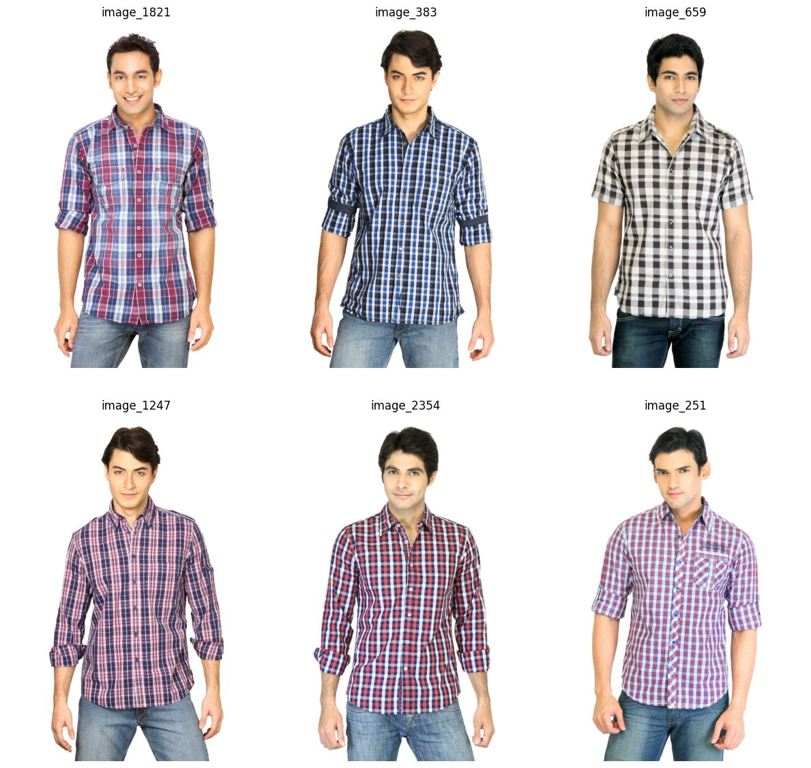
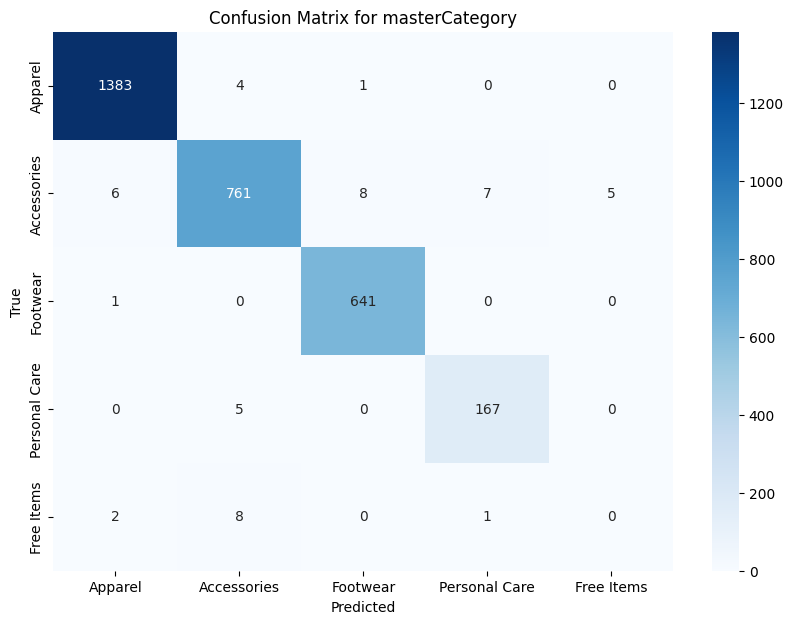

# Fashion Image Similarity and Recommendation System

This project is a **fashion image similarity and recommendation system** built using deep learning and computer vision techniques. The system allows for finding visually similar fashion items based on a given query image. The project utilizes a pre-trained convolutional neural network to extract embeddings from fashion images, computes similarity scores between images, and recommends similar items to users. It also includes a comprehensive evaluation framework to assess the accuracy and relevance of the recommendations.

## Table of Contents
- [Project Overview](#project-overview)
- [Features](#features)
- [Evaluation](#evaluation)

## Project Overview

The Fashion Image Similarity and Recommendation System is designed to:
1. Load a dataset of fashion images and associated metadata.
2. Extract embeddings using a pre-trained neural network model (e.g., ResNet50 or EfficientNet).
3. Compute similarity between images based on their embeddings.
4. Generate and visualize recommendations for similar items.
5. Evaluate the recommendation system’s accuracy and relevancy based on similarity-driven predictions.

## Features

- **Image Embedding Extraction**: Uses pre-trained CNN models (ResNet50, EfficientNet) to extract feature vectors (embeddings) for fashion images.
- **Similarity Computation**: Calculates cosine similarity scores to measure the visual similarity between images.
- **Recommendation System**: Provides similar fashion items based on a query image.
- **Evaluation Framework**: Includes precision, recall, F1-score, and confusion matrices for assessing recommendation quality.

## Evaluation

Similarity results:

### For Resnet50:


### For Efficientnet:



### Observations

Consistency in Pattern and Style:
Both ResNet50 and EfficientNetB0 identified items with a similar plaid/checkered pattern, which indicates that both models are performing well in capturing the visual similarity of patterns.
EfficientNetB0 appears to have a slight edge in providing variations in color within the same pattern, suggesting it may capture nuanced visual features.


### Variation in Recommendations:

ResNet50:
The recommendations tend to feature shirts that closely match the color and pattern of the query image.
The selection is consistent but may be slightly less diverse in capturing variety.

EfficientNetB0:
EfficientNet's results show a broader range of plaid colors and styles, which could be beneficial if the aim is to offer visually similar but varied options.
EfficientNet seems to slightly outperform in distinguishing variations within the same style (plaid pattern).

### Image Quality and Details:
Both models seem to generate high-quality recommendations, but EfficientNetB0's results may have a marginal advantage in distinguishing fine-grained details like pattern variations and fabric type, which is typical of EfficientNet’s superior performance in fine-tuned tasks.

### Confusion Matrix for resnet50



### Confusion Matrix for efficientnet


```markdown 
# Classification report for two models:

Resnet Classification Report for masterCategory:
               precision    recall  f1-score   support

      Apparel       0.98      0.97      0.97       787
  Accessories       0.99      1.00      0.99      1388
     Footwear       0.99      1.00      0.99       642
Personal Care       0.00      0.00      0.00        11
   Free Items       0.95      0.97      0.96       172

     accuracy                           0.98      3000
    macro avg       0.78      0.79      0.78      3000
 weighted avg       0.98      0.98      0.98      3000


 Efficientnet Classification Report for masterCategory:
               precision    recall  f1-score   support

      Apparel       0.98      0.98      0.98       787
  Accessories       1.00      1.00      1.00      1388
     Footwear       0.99      1.00      0.99       642
Personal Care       0.00      0.00      0.00        11
   Free Items       0.97      0.98      0.97       172

     accuracy                           0.99      3000
    macro avg       0.79      0.79      0.79      3000
 weighted avg       0.99      0.99      0.99      3000

 ``` 


Based on classification report of two model we can conclude:

EfficientNet slightly outperforms ResNet with an accuracy of 99% versus 98%. It achieves higher precision and recall in Accessories and Free Items, and performs slightly better in overall macro and weighted averages. Both models perform poorly on Personal Care due to the very low support (only 11 instances). For most categories, EfficientNet provides marginally better classification metrics, indicating a more balanced performance across the dataset.


## Computational time:

Efficientnet -- 830.68 sec
Resnet50 -- 1305.342 sec 

We can whicle Efficientnet performs better as well as computationally effectivecompared to resnet50.